# Project 1: Standardized Test Analysis
## by: Matthew Edelmann

### Overview

This is an overview of my project. 

### Problem Statement

 Many school make the SAT (or ACT) optional while others do not. I want to know if we should make the SAT (or ACT) optional or not.

### Datasets

We use 2 data sets. One is the SAT participation rates and average scores by state. The other is the average SAT and ACT as well as acceptance rate for various colleges in the United States.

* [`sat_2019.csv`](./data/sat_2019.csv): 2019 SAT Scores by State ([source](https://blog.prepscholar.com/average-sat-scores-by-state-most-recent))

* [`sat_act_by_college.csv`](./data/sat_act_by_college.csv): Ranges of Accepted ACT & SAT Student Scores by Colleges ([source](https://www.compassprep.com/college-profiles/))
### Deliverables

We have 2 sets of data. The first we will call sat_act.

There are 5 main columns we need to look at here. The number of applicants, the SAT score, the ACT score, the acceptance rate of a college, and whether of not the test is optional after 2021. We will seperate it into 2 other dataframes. sat_test and sat_notest. These are simply if the test is required for 2022 (sat_test) or if it is not (sat_notest). 

Let's look at the standard deviation and the mean of each:

sat_act:
{'num_of_applicants': 17657.892310364598,
 'acceptance_rate': 0.2372650569386208,
 'sat_25th': 118.82675147257011,
 'sat_75th': 101.37609424140074,
 'sat_middle': 108.86508370865361,
 'act_25th': 3.8218167245935386,
 'act_75th': 2.7659728538916752,
 'act_middle': 3.249329419717,
 'test_required_post_2021': 0.49996807967310464}
 
sat_test:
{'num_of_applicants': 17104.19188166743,
 'acceptance_rate': 0.2519672476286372,
 'sat_25th': 136.6481056717343,
 'sat_75th': 113.26020609955756,
 'sat_middle': 123.686352966704,
 'act_25th': 4.268059101019563,
 'act_75th': 3.072838002198468,
 'act_middle': 3.62954884473629,
 'test_required_post_2021': 0.0}
 
 sat_notest:
 {'num_of_applicants': 17233.826023119476,
 'acceptance_rate': 0.21465771159721675,
 'sat_25th': 95.10821657340342,
 'sat_75th': 86.60121560342279,
 'sat_middle': 89.6944279194659,
 'act_25th': 3.285438714951468,
 'act_75th': 2.4073642776296005,
 'act_middle': 2.796243556658008,
 'test_required_post_2021': 0.0}
 
 We can see that the standard deviation is mostly the same in each of the cadigories except for SAT scores. For SAT scores, sat_test had the highest standard deviation and sat_notest is in the middle.
 
Now let us look at the same for the mean:

sat_act:
{'num_of_applicants': 17409.985875706214,
 'acceptance_rate': 0.5510423728813554,
 'sat_25th': 1179.7401129943503,
 'sat_75th': 1371.6892655367233,
 'sat_middle': 1275.7146892655367,
 'act_25th': 25.139265536723162,
 'act_75th': 30.29604519774011,
 'act_middle': 27.717655367231636,
 'test_required_post_2021': 0.4943502824858757}
 
 sat_test:
 {'num_of_applicants': 21579.571428571428,
 'acceptance_rate': 0.510457142857143,
 'sat_25th': 1197.6914285714286,
 'sat_75th': 1383.8,
 'sat_middle': 1290.7457142857143,
 'act_25th': 25.521714285714285,
 'act_75th': 30.527428571428572,
 'act_middle': 28.02457142857143,
 'test_required_post_2021': 1.0}
 
 sat_notest:
{'num_of_applicants': 13333.575418994413,
 'acceptance_rate': 0.5907206703910618,
 'sat_25th': 1162.1899441340781,
 'sat_75th': 1359.8491620111731,
 'sat_middle': 1261.0195530726257,
 'act_25th': 24.76536312849162,
 'act_75th': 30.06983240223464,
 'act_middle': 27.41759776536313,
 'test_required_post_2021': 0.0}
 
 As we can see, the sat, act and acceptance rate means are mostly the same in each categories. The only category with major differences is the number of applicants.
 
 Now let us look at a heat map for each of these dataframes:
 
 sat_act:
 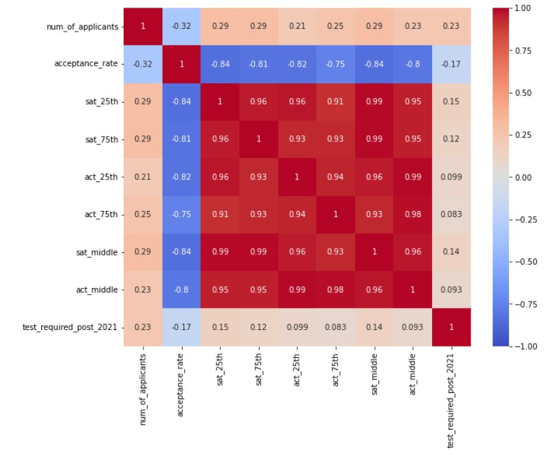
 
 Here we see that neither the number of applicants nor whether or not the test was required has any correlation to the acceptance rate. We alse see that colleges look at SAT and ACT equally. Most importantly, as acceptance rate increases, average SAT and ACT scores decrease.
 
 sat_test:
 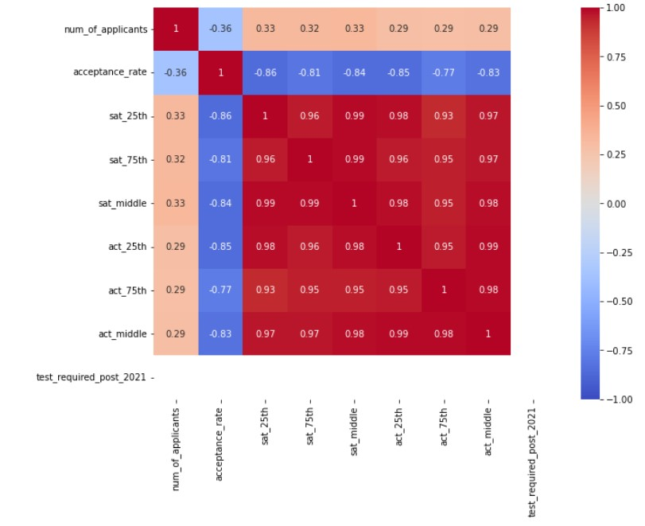
 
 sat_notest:
 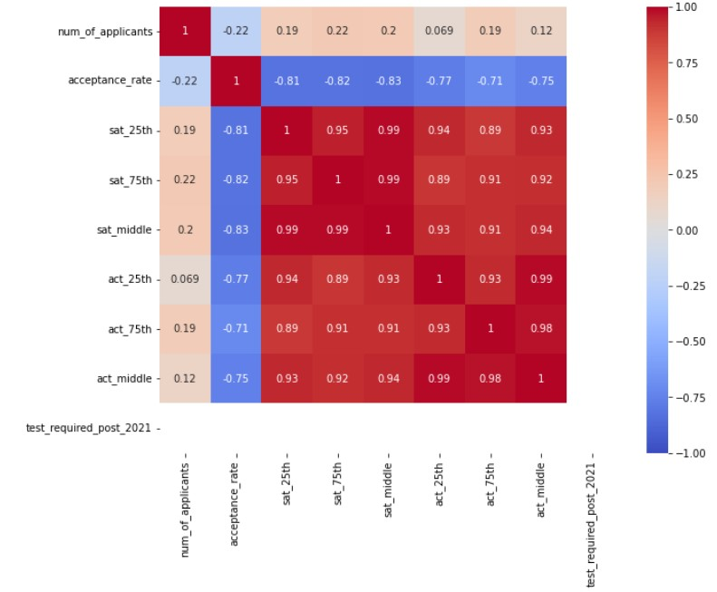
 
 This shows there is almost no difference in correlation wheather or not the test was required or not.
 
 Now let's look at a few plots to realy visualize this:
 
 sat_act:
 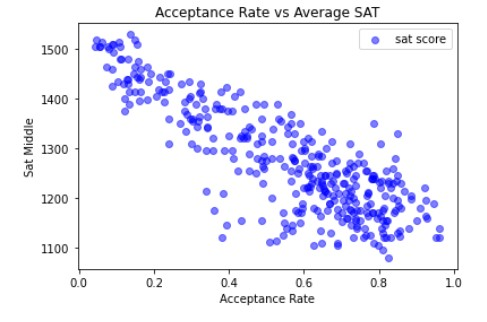
 
 This shows as acceptance rate increases, SAT scores decrees
 
 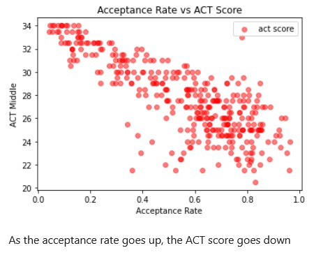
 
 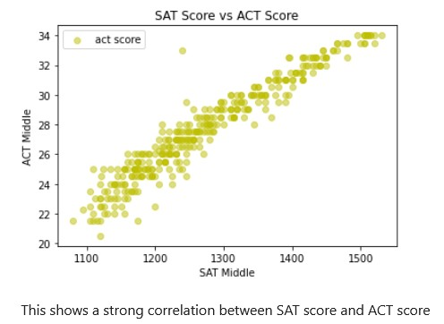
 
 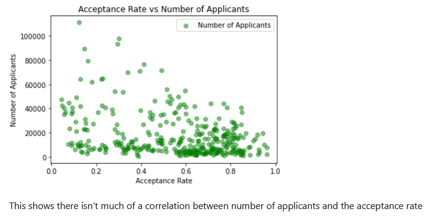
 
 sat_test:
 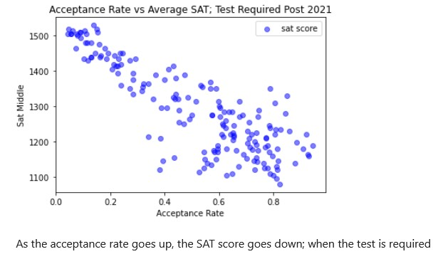
 
 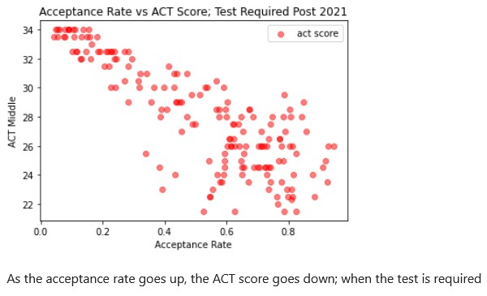
 
 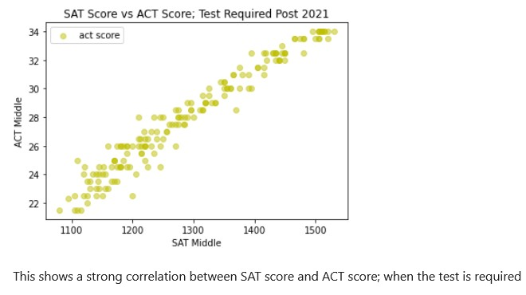
 
 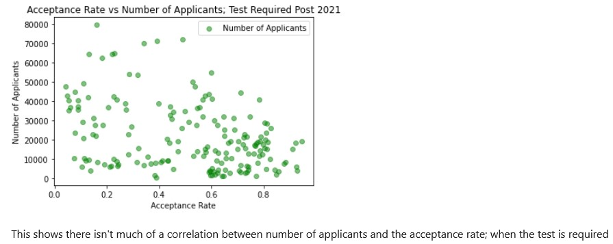
 
 sat_notest:
 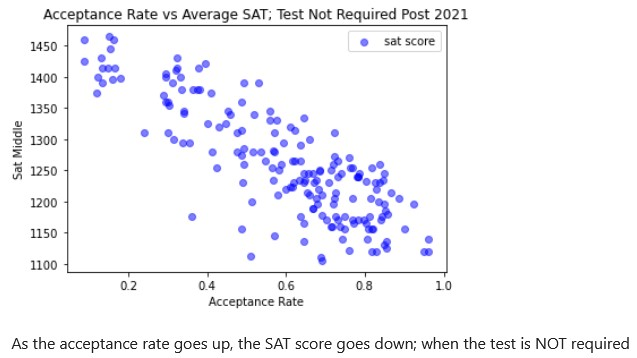
 
 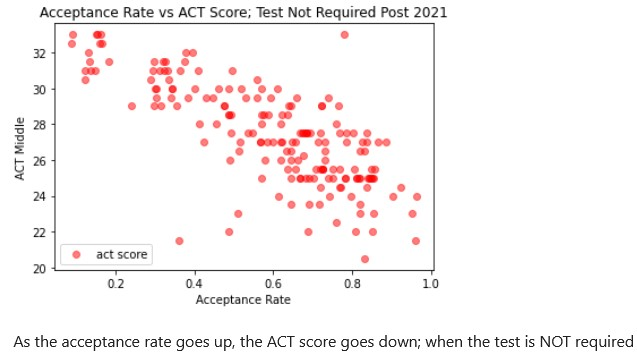
 
 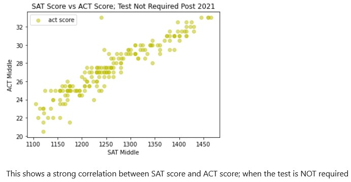
 
 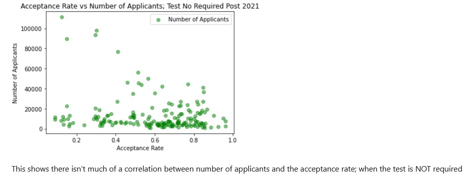
 
 Now we look at the next data set. We will call this the states.
 
 This gives us the participation rate of students who take the SAT in each respective states. It also shows the average math SAT score, the average ebrw SAT score, and the average total SAT score in each state. We will look at the same data as before starting with the standard deviation:
 
 states:
 {'participation_rate': 0.3836584048685726,
 'ebrw': 45.792378682545134,
 'math': 50.78521461840036,
 'total': 96.24027185617864}
 
 Not only are the math and ebrw standard deviations similar, the total standard deviation is about the math and ebrw SD added together.
 
 Now the mean:
 
 states:
 {'participation_rate': 0.49058823529411755,
 'ebrw': 560.8039215686274,
 'math': 552.1960784313726,
 'total': 1113.078431372549}
 
 Let's look at the heat map:
 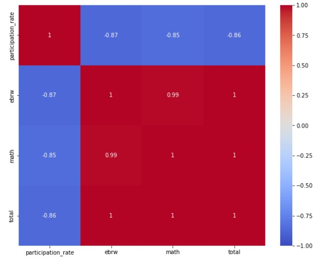
 
 This shows that the participation rate is negativily correlated with SAT scores. This means that states that require the SAT or that a high percent of students take the SAT typically have a lower test score than states that have low SAT participation
 
 Now for some plots:
 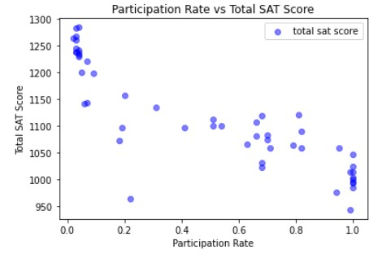
 
 This shows that there is some negative correlation between participation rate and total SAT score
 
 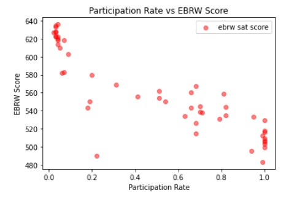
 
 This shows that there is some negative correlation between participation rate and EBRW SAT score
 
 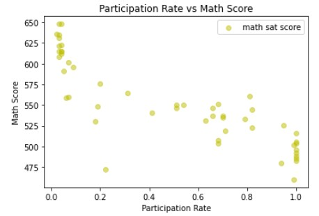

 This shows that there is some negative correlation between participation rate and math SAT score
 
 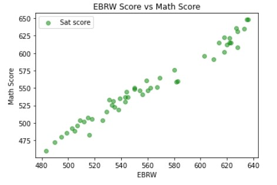
 
 This shows a strong correlation between the Math score and the EBRW score
 
 ### Conclusion
 
 Based on these findings, I recommend requiring either the SAT or ACT Exams. I say this because we see that even when it isn't required, it doesn't effect the average SAT scores of the school being applied to. Also, since schools that don't require the SAT scores tend to have higher SAT scores, this seems to mean that students that don't do well on it seem to just try to bypass it. But it is a good indicator if you belong in the college you are applying to. Also, we see that the ACT is just as good of an indicator as the SAT.

### Technical Report
[starter code](./code/starter-code.ipynb) 

### Style Guide and Suggested Resources

[Tim Dwyer](https://www.linkedin.com/in/jtimdwyer/) (former DSI student and TA) put together [this style guide](https://git.generalassemb.ly/DSIR-523/style-guide). Some recommendations are geared toward future projects (which will include modeling and span multiple notebooks), but generally these are great recommendations.

Here's a link on [how to give a good lightning talk](https://www.semrush.com/blog/16-ways-to-prepare-for-a-lightning-talk/), which provides some good recommendations for short presentations.

[Here's a great summary](https://towardsdatascience.com/storytelling-with-data-a-data-visualization-guide-for-business-professionals-97d50512b407) of the main points of the book _Storytelling with Data_, which I can't recommend enough. [Here's a blog post](http://www.storytellingwithdata.com/blog/2017/8/9/my-guiding-principles) by the author about his guiding principles for visualizations.

---

### Submission

**Materials must be submitted on Friday, June 3.**

Your technical report will be hosted on Github Enterprise. Make sure it includes:

- A README.md (that isn't this file)
- Jupyter notebook(s) with your analysis (renamed to describe your project)
- Data files
- Presentation slides
- Any other necessary files (images, etc.)

**Please fork the project, download or clone to your local machine, and submit a link in the [Google Classroom](https://classroom.google.com/u/1/c/MzYyMzc5NTA5OTgy) assignment.**

---

### Presentation Structure

**You must be ready to present your findings by the start of class on June 3.**

- **Must be within time limit - not more than 5 minutes.**
- Use Google Slides or some other visual aid (Keynote, Powerpoint, etc).
- Consider the audience. Assume you are presenting to a non-technical audience (executives with the College Board, school administrators, admissions counselors, State officials, etc.).
- Start with the **data science problem**.
- Use visuals that are appropriately scaled and interpretable.
- Talk about your procedure/methodology (high level, **CODE IS ALWAYS INAPPROPRIATE FOR A NON-TECHNICAL AUDIENCE**).
- Talk about your primary findings.
- Make sure you provide **clear recommendations** that follow logically from your analyses and narrative and answer your data science problem.

Be sure to rehearse and time your presentation before class.

